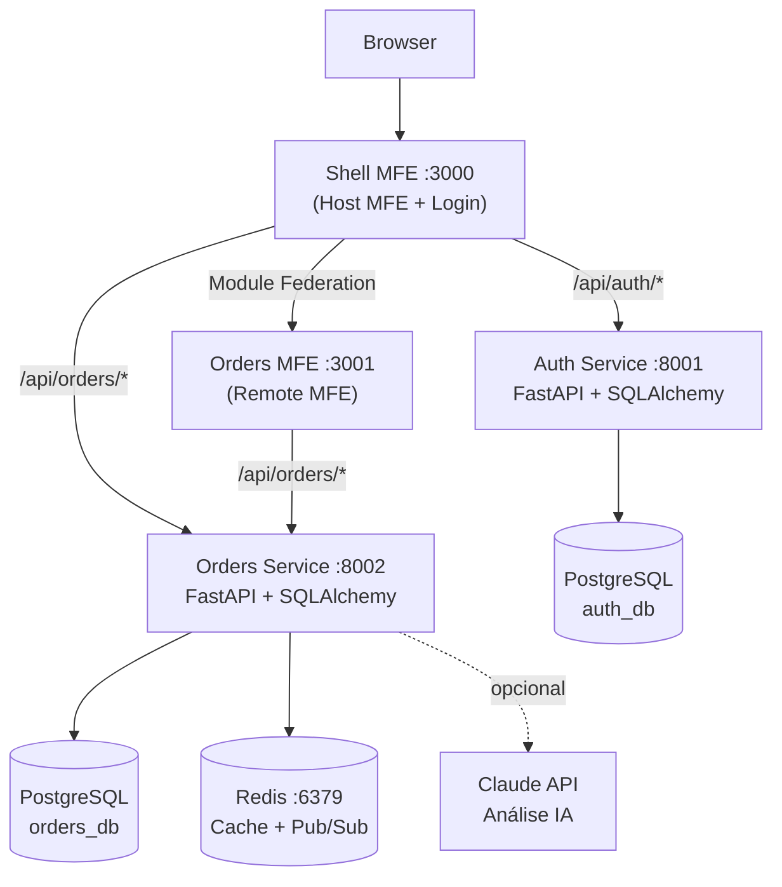

# Plataforma de Gestão de Pedidos — PMV

**Desafio Técnico · CGSE/SSGINF/SE/CC · Presidência da República  · Edital nº 173/2026**

Plataforma interna de gestão de pedidos que substitui o controle por planilhas
por um sistema centralizado com autenticação, rastreamento de ciclo de vida e
análise por inteligência artificial. Dois microserviços Python (FastAPI), dois
microfrontends React com Module Federation, PostgreSQL, Redis e Docker Compose.

---

## Metodologia: Spec-Driven Development

Este projeto adota **Spec-Driven Development (SDD)** via
[SpecKit](https://github.com/github/spec-kit), framework open-source do GitHub para desenvolvimento assistido por
IA com governança e rastreabilidade.

O processo seguido neste projeto:

| Etapa | Artefato | Localização |
|-------|----------|-------------|
| **1. Constitution** | Princípios inegociáveis — 10 gates de qualidade | `.specify/memory/constitution.md` |
| **2. Specification** | O quê construir e por quê — user stories com critérios de aceite | `specs/001-order-mgmt-platform/spec.md` |
| **3. Plan** | Como construir — trade-offs, tech stack, estrutura de arquivos | `specs/001-order-mgmt-platform/plan.md` |
| **4. Tasks** | Implementação faseada — 90+ tarefas com critérios de aceite individuais | `specs/001-order-mgmt-platform/tasks.md` |
| **5. Analyze** | Verificação de consistência entre artefatos antes do código | Contracts em `specs/.../contracts/` |
| **6. Implement** | Geração de código guiada pelas specs | Este repositório |
| **7. Review** | Validação humana + testes automatizados + agentes especializados | CI + testes |

Todas as especificações estão versionadas em `specs/` e `.specify/` e são a
**fonte de verdade** do projeto. Cada decisão técnica é rastreável da spec ao
código — nunca o contrário.

Para um time de 15 servidores na coordenação mais estratégica do governo
federal, SDD oferece: multiplicação da capacidade individual sem perda de
coerência; onboarding acelerado via specs legíveis por qualquer analista;
e consistência nas entregas porque as regras existem antes do código.

---

## Arquitetura



**Componentes:**

| Componente | Responsabilidade |
|-----------|-----------------|
| **Shell MFE** | Host da aplicação: login, registro, navegação, carrega o Orders MFE via Module Federation |
| **Orders MFE** | Microfrontend remoto com CRUD completo de pedidos — funciona standalone ou federado |
| **Auth Service** | Registro e autenticação de usuários; emite JWTs assinados com `JWT_SECRET` |
| **Orders Service** | CRUD de pedidos com state machine de status; cache Redis; análise IA |
| **PostgreSQL** | Um container, dois databases lógicos (`auth_db`, `orders_db`) — isolamento por serviço |
| **Redis** | Cache de listagens (TTL 5min) + Pub/Sub de eventos de pedidos |

**Fluxo de uma requisição:**
Browser → NGINX (Shell :3000) → `/api/orders/*` → FastAPI → Pydantic validation
→ SQLAlchemy async → PostgreSQL → JSON response → TanStack Query → React render.

---

## Decisões Técnicas

**FastAPI vs Django/Flask** — FastAPI oferece async nativo, validação via Pydantic
v2, Swagger automático e é 3–5× mais leve que Django para microserviços.
Escolha óbvia quando o requisito é "dois serviços independentes com OpenAPI".

**Module Federation** — Shell e Orders MFE são deployados independentemente.
O Shell carrega `remoteEntry.js` em runtime via `@originjs/vite-plugin-federation`.
`react-router-dom` é configurado como `singleton` para evitar conflito de contexto
de roteamento entre o host e o remote.

**Database per Service** — `auth_db` e `orders_db` vivem no mesmo container PostgreSQL
mas são completamente separados. Nenhum JOIN cross-service — isolamento garante que
cada serviço pode evoluir seu schema sem afetar o outro.

**Redis dual-purpose** — Um único componente resolve dois requisitos: cache de listagens
(evita queries repetidas com TTL de 5 minutos) e Pub/Sub para eventos de pedidos
(`order_created`, `order_updated`). Dois requisitos, uma tecnologia.

**JWT compartilhado** — `JWT_SECRET` é a única dependência entre os serviços. O
`orders-service` valida tokens localmente sem chamada HTTP ao `auth-service` —
elimina latência e ponto de falha adicional.

**IA com fallback** — A análise via Claude API (`claude-sonnet-4-20250514`) sempre tem
fallback rule-based: se `ANTHROPIC_API_KEY` estiver ausente ou a API falhar, regras
determinísticas garantem uma resposta. O endpoint nunca retorna 5xx por falha de IA.

---

## Como Executar

### Pré-requisitos

- Docker e Docker Compose instalados
- Porta 3000, 3001, 5432 e 6379 disponíveis

### Startup

```bash
git clone <repo-url> && cd pedidos-platform
cp .env.example .env
# Edite JWT_SECRET e, opcionalmente, ANTHROPIC_API_KEY
docker-compose up --build
```

O serviço `seeder` sobe automaticamente após os backends e popula o banco com
dados de demonstração. Aguarde a mensagem `✅ Seed concluído!` nos logs.

### URLs

| Serviço | URL |
|---------|-----|
| Plataforma (Shell) | http://localhost:3000 |
| Orders MFE (standalone) | http://localhost:3001 |
| Auth API (Swagger) | http://localhost:8001/docs |
| Orders API (Swagger) | http://localhost:8002/docs |

### Credenciais de Demo

| Usuário | Senha |
|---------|-------|
| admin@gov.br | Teste@123 |
| operador@gov.br | Teste@123 |
| viewer@gov.br | Teste@123 |

---

## Como Rodar Testes

```bash
# Auth Service — 5 testes (register, duplicate, login, wrong password, get me)
docker-compose exec auth-service pytest tests/ -v

# Orders Service — 9 testes (CRUD, filtros, state machine, autenticação)
docker-compose exec orders-service pytest tests/ -v
```

O CI executa automaticamente em push para `main` via GitHub Actions (`.github/workflows/ci.yml`):
- Backend: `ruff check` + `pytest` (matriz auth/orders)
- Frontend: `tsc --noEmit` + `npm run build` (matriz shell/orders-mfe)

---

## O Que Faria Com Mais Tempo

**2 semanas:**
E2E com Playwright cobrindo fluxos críticos; dashboard Prometheus + Grafana para
latência e taxa de erro; rate limiting por usuário no endpoint de IA.

**1 mês:**
API Gateway (Kong ou Traefik) para centralizar auth e rate limiting;
Kafka substituindo Redis Pub/Sub para durabilidade de eventos;
feature flags para rollout gradual de funcionalidades.

**3 meses:**
Kubernetes + Helm para deploy em ambiente GOVCLOUD;
Service Mesh (Istio) para mTLS entre serviços;
MLOps para monitorar drift nas análises de IA;
compliance LGPD automatizado com relatórios de auditoria.

---

## Sobre o Uso de IA no Desenvolvimento

Eu defini 100% das especificações, arquitetura e critérios de qualidade.
As specs em `.specify/` e `specs/` existiam antes do primeiro arquivo de código.
O código foi gerado por **Claude Code** a partir dessas specs, e cada linha
foi revisada, validada e — em muitos casos — corrigida por mim.

Agentes especializados foram usados como revisores: `security-reviewer` na
integração com a API Claude (encontrou 3 findings, todos resolvidos),
`code-reviewer` nos testes (encontrou problemas de isolamento, todos resolvidos),
`architect` nas decisões de Module Federation.

Esta transparência é parte da proposta: SDD com IA como acelerador, não como
substituto do julgamento de engenharia.

---

## Tecnologias

| Camada | Tecnologia | Justificativa |
|--------|-----------|---------------|
| Backend | Python 3.11 + FastAPI | Async nativo, Pydantic v2, OpenAPI automático |
| ORM | SQLAlchemy 2.0 async + Alembic | Migrations rastreáveis, sem raw SQL |
| Frontend | React 18 + TypeScript 5 + Vite | Tipagem estrita, DX moderna, build rápido |
| MFE | @originjs/vite-plugin-federation | Module Federation em Vite sem Webpack |
| Estado servidor | TanStack Query v5 | Cache, loading states, invalidação automática |
| Estado cliente | Zustand | Token em memória (sem localStorage) |
| Banco de dados | PostgreSQL 16 | JSONB para itens, robusto, padrão gov |
| Cache/Eventos | Redis 7 | Dois requisitos, uma tecnologia |
| Autenticação | JWT (python-jose) | Stateless, sem round-trip entre serviços |
| IA | Claude API + fallback rule-based | Resiliente — nunca retorna 5xx por falha de IA |
| Logs | structlog (JSON) | Correlation ID, queryável em Cloudwatch/Elasticsearch |
| CI | GitHub Actions | Lint + testes + build em cada PR |
| Containers | Docker Compose v2 | Stack completa em um comando |

---

## Estrutura do Projeto

```text
pedidos-platform/
├── docker-compose.yml
├── .env.example
├── .github/workflows/ci.yml      # CI: ruff + pytest + tsc + build
├── services/
│   ├── auth-service/             # FastAPI :8001 · banco auth_db
│   │   ├── app/
│   │   │   ├── api/v1/endpoints/ # /register, /login, /users
│   │   │   ├── core/             # config, security, database, logging
│   │   │   ├── models/           # SQLAlchemy User model
│   │   │   └── schemas/          # Pydantic UserResponse, TokenResponse
│   │   └── tests/                # pytest + SQLite in-memory
│   └── orders-service/           # FastAPI :8002 · banco orders_db
│       ├── app/
│       │   ├── routes/           # /pedidos (CRUD), /pedidos/{id}/ai-analysis
│       │   ├── core/             # config, database, cache, events, logging
│       │   ├── models/           # Order, OrderStatus, Priority
│       │   └── schemas/          # OrderCreate, OrderResponse, AIAnalysisResponse
│       ├── scripts/seed.py       # Dados de demonstração (12 pedidos govbr)
│       └── tests/                # pytest + fakeredis + SQLite in-memory
├── frontend/
│   ├── shell/                    # Host MFE :3000 · Login + navegação
│   │   └── src/
│   │       ├── store/authStore.ts # Zustand — token em memória
│   │       └── pages/            # LoginPage, RegisterPage
│   └── orders-mfe/               # Remote MFE :3001 · CRUD de pedidos
│       └── src/
│           ├── components/       # OrderList, OrderForm, OrderDetail, AISummary
│           ├── hooks/            # useOrders, useOrderDetail, useCreateOrder
│           └── lib/api.ts        # Axios + interceptors de auth/error
└── specs/001-order-mgmt-platform/
    ├── spec.md                   # User stories com critérios de aceite
    ├── plan.md                   # Arquitetura e decisões técnicas
    ├── tasks.md                  # 90+ tarefas faseadas
    └── contracts/                # Contratos de API por serviço
```

---

## Autor

**Kennedy Simões Santos Carvalho**  
Analista de TI — INES/MEC  
kennedy@ines.gov.br · kennedysimoes@gmail.com
